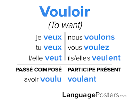

# Conjugueur
Conjugue les verbes français au plusieurs temps, avec une commande vocale.

- This plugin is an add-on for the [A.V.A.T.A.R](https://avatar-home-automation.github.io/docs) framework. 

 ## 🎯 Usage
Exemples de commandes :
« Conjugue le verbe manger au présent »
« Conjugue être à l'imparfait »
« Conjugue finir au futur »
« Conjugue prendre au passé simple »
« Conjugue aller au passé composé »

## Multi-room

The `Conjugueur` plugin is fully multi-room.

The `Salutation` plugin relies solely on the system's available languages.

 <table style="border: none;">
  <tr>
    <td style="border: none;"></td>
    <td style="border: none;">
      <h1 style="margin: 0;color: brown;">Conjugueur</h1>
      <h3 style="margin: 0;">Conjugate Verbe</h3>
    </td>
  </tr>
</table>
